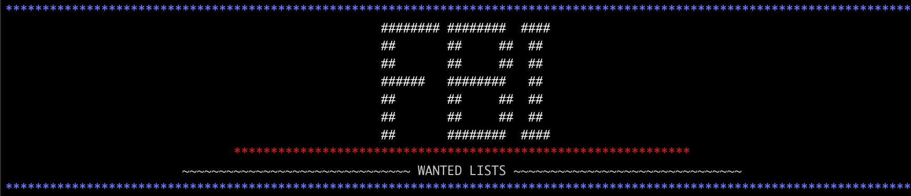

[HOME](../README.md)

## What you did for your project...

Since I find myself watching all these true crime shows on Netflix or listening to TrueCrime podcasts, I thought I would dive into the realm of crime.  I found that the FBI most wanted website had a free api, so why not!?! I parsed the data into (2) classes: `Person` and `CaseFile`.  I extracted all the information on the case categories that were setup and then created navigation menus for the user to go through and view the information for each individual.

## What difficulties/issues you encountered, and how you got around them

I initially struggled at the beginning, what it was I wanted to do and how to set up the project.  I think the process took me so long to come up with an idea, that I just jumped right into coding a not falling behind on the project.  I did not properly setup and pre-plan as much as I should have and during the project, I would find myself getting lost on little tangents - than focusing on major functionality.

I had to step back and focus on the requirements and then I could jump into the more fun details.  I have learned the struggles of not planning upfront, and will ensuer that going forward the more time I do plan will only make it easier down the line.

## What you learned from the project

I ended up having fun with this project.  At the beginning I was feeling a bit behind on labs and while I understood the concepts, time did not seem to be a friend.  I was thrown a bit with all the Inheritance classes and modules.  

After getting deep into my project, I truly learned the wonderful ways to this subject.  Setting up a formatting module and then a class for my objects to inheritance that code - made so much sense to me after I saw how it made my codin so much easier and less repetitious.

I feel like I could be a good at Ruby, but really am proud of myself for graspin these concepts that I know will be so useful in the future.