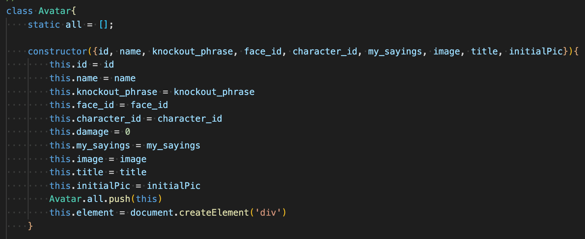
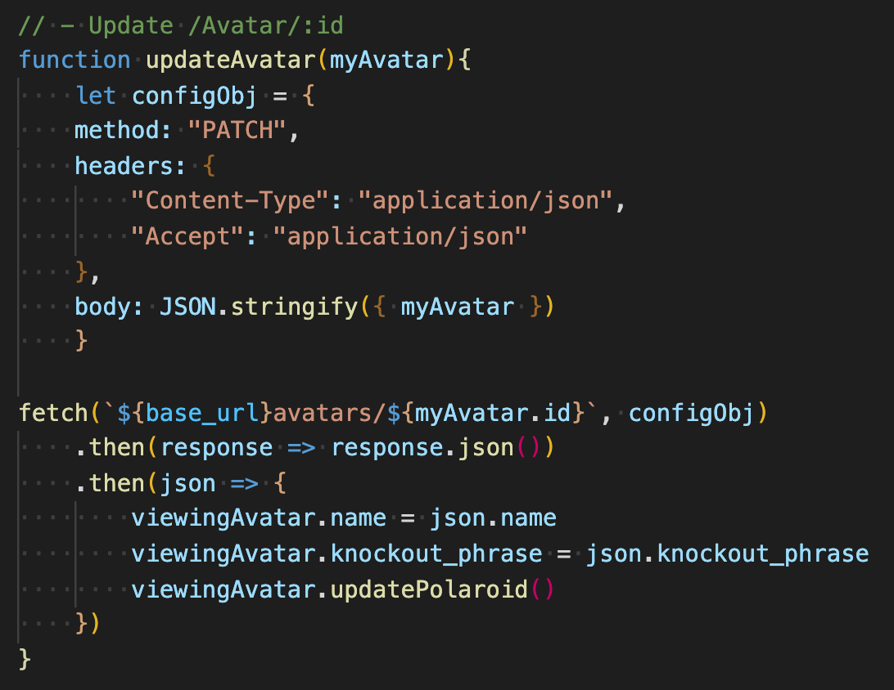
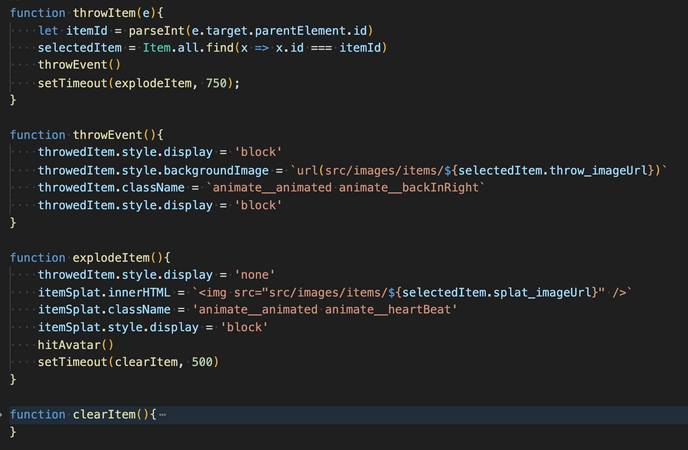
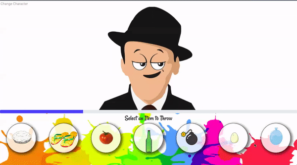
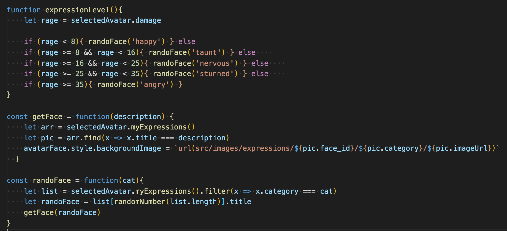
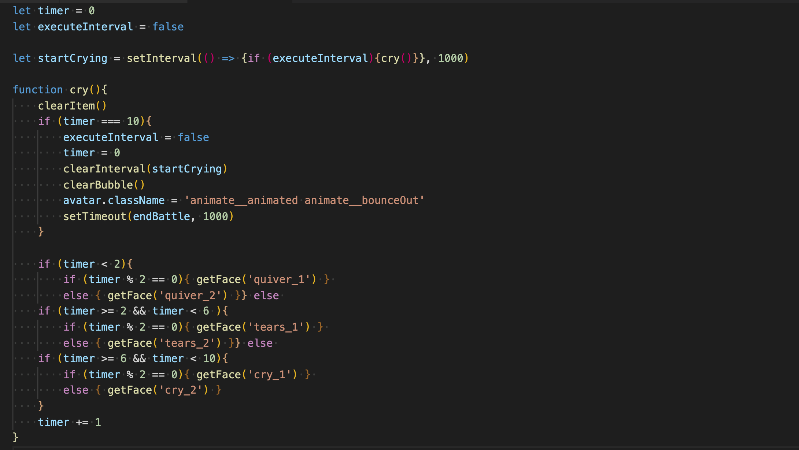
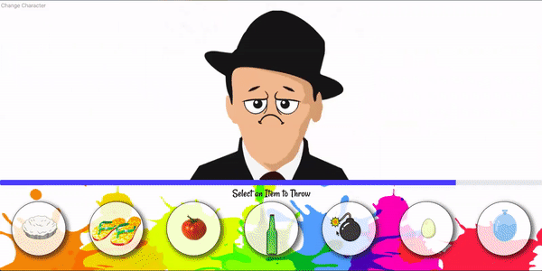

[HOME](../README.md)

---

# Javascript! ~ Getting over that midway hump!

Continuing on to Phase4; Javascript really started to open things up for me.  I had struggled during the Rails portion, not as much with grasping knowledge but more of a mid-way hump of the course and feeling discuraged.  So when javascript came around and we had to develop a single page application, I decided to have a little fun with it.  Loving the idea of making elements come to life on the page, I had a thought ... *Why not make Ruby as frustrated as its made me in the passed?*  So I did, and it definately cheered me up! 

## Plan of ATTACK!

So for this project, I started with the basic concept - `I have a Character, that I want to throw an Item at`.  So right away, I knew I needed a Character and Item model.  But in order to meet the project requirements, I had to have atleast one `has_many` relationship.  So you know what I thought ... Damn if I haven't been frustrated with all the error codes I've gotten in the passed - let's have my Character `have_many sayings`, creating my Sayings model.  With the basic concept in mind, I began on my journey.  I seeded some data, knowing that I wanted a few default charachters (Sinatra, Ruby, Java), some fun items (Pie, Bomb, shoe) and a few stock sayings.

It was hard for me to resist the urge to jump in and get to the design of it all - But I've learned from passed projects, it is not the way!  So I set out and created all my elements to have borders/padding and different colors.  It helped me visually identify my elements, as I continued to build my javascript files.

## Creating my Oject Class

I decided to use my Character (later changed to Avatar) to start for my Object Orientated Class, the thought was that as my item hits my character it will do damage, changing that attribute each time. I ended up building everything off of this class and creating class methods to handle a lot of the DOM manipulation.

I found it helpful with this approach because I setup variables to hold my specific object data relevant at that current moment.  So when I would need to manipulate the DOM on my set `viewingAvatar` or `selectedAvatar` I could just the class method since those referenced an Avatar Object. Easy Enough!  I even found that when I was doing fetch requests - I could get by with just changing the object data, and not the database (But doing that would defeat the purpose of the project!).

As my project grew I created additional class Objects for my `Items` and `Expressions`.   Items were a non-relational piece of my project.  However, Expressions were to play a bigger and more fun role in this project!

## CRUD, DOM it!

So here was my dreaded portion, damn `.fetch()` requests. Sure, easy enough to GET data, but Ugh, some struggeles to Create/Update.  `debugger>json>serializer>reload` - REPEAT! It took me a good portion of time to fully grasp what was happening with the data coming back and how to retrieve it in the way I wanted.  Once I got this, I thought - Why would I want to keep doing this?? Just set this information to my object and call it a day.  Done!  I'm not doing a bunch of fetch request, but with the size of my app, I'm afforded to do that.  No doubt making api calls to other sites will prove a bit more challenging, but I definately grasped the concept of how my json data was being returned to me.

I used both FastJSON as well as `.to_json` methods.  Seeing both the values of each, and honestly not sticking on one over another!  I found that when I first set my class information from the `GET` method - I would use a serializer, but liked the way the data came back using the `.to_json` with my `UPDATE` requests (seeing as I was only changing small amounts of data)After getting the data how I wanted, it was not problem rendering the DOM.

## EVENTS GALORE!!!

## Throwing an Item

The way I setup my items, I had 3 different images (base image, throw image, and splat image).  Once a user selects an image of an item, it will then appear on the page as the throw item and animate across the page until it reaches its destination and turns into a splat image.  To do this, I utilitze the [Animate.css](https://animate.style/) css library.  Once I setup the correct link in my `<head>`, all I had to do was change the `className` to the correct animation style.

In order to make it look like it was looking as it hit and then splat - i had to setup some `setTimeout()` functions.  This provided slightly difficult getting timing right.  And also learning that you have to specify the function inside the callbacks.  Too many times I was invoking it immediatly, and my `setTimeout` just didnt fire correctly, hence the reason everything is in seperate functions.  It worked and I'm Happy!!

## Bringing my Avatar Life

It wasn't enough to just throw things, I hadto make my avatar come to life (i.e. give them some expressions) - I had setup (4) different Face styles, then created many expressions for those faces.  Each Face had x-number of expressions, and each of those expressions belonged to a pre-determined category. (Sounds like a lot, not really).  As my Avatar got hit, I increased their damage so I wanted their face to change.  I setup a quick function to see the damamge level, and choose a random image from that category to be displayed.  The way I setup the images with `FaceID/Category/title` lent for an easier way too select the random image directory/location.  So once I setup these few functions, it really didn't matter which face I used, OR how many were in each category.  And then making it random only made it funnier everytime I hit my Avatar.

## It really was all about making them CRY!!!

Even though I was getting my kicks out of seeing them get a little angrier, my whole goal was to make my Avatar cry!! I setup a range of 50, and once the damage level reached that I wanted my event to start.  It was a bit trickier to do this because I wanted my avatar to loop through a few of my pictures multiple times.  For each Face, I setup a cry sequence of images that would loop through in a setTimeout style.  however, with SetTimeout i was limited to one action.  However, my work around was to utilize `setInterval()` which will run my code in a loop until I tell it to STOP (`clearInterval()`).  But one thing I learned, is that my setInterval had to be it's own function that was later to be used in a callback, so I could not just put all my code into one function.

I knew the series of events I wanted to take, `quiver -> tear up -> start crying`.  How do I accomplish this? well... My solution was to use a timer! depending on the timer count, the image would change.  If it were within a range it would show what I wanted (i.e. quiver/tears/cry) - but then if it were even, it would show one image/odd would show another.  This gave the illusion that the expressions were changing and I could end up setting the times to whatever I choose.  But in order for my times to work correctly, I needed to setup a boolean that was used in my initial function call.  If that was set to true then my Avatar could start crying, else it wouldn't.  Then it was easy for me, once I hit the end of the cry event to change back my boolean to false and finish the game.  

This brought me so much joy to see the final result!

