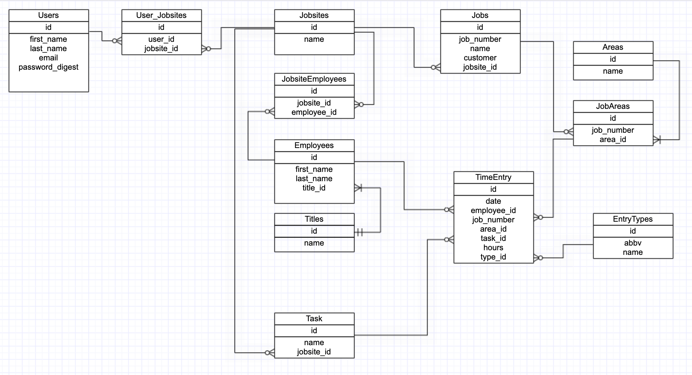
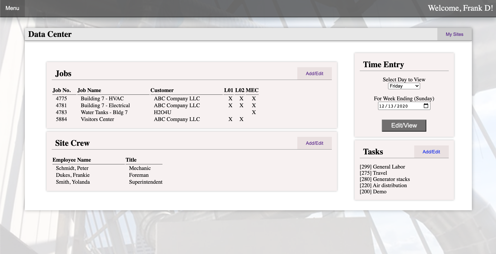

[HOME](../README.md)

---

# Sinatra App

This sinatra phase has been an interesting one.  I've had some background with SQL and have done some query writing, so I enjoyed learning how to connect the backend and the database connectivitiy to really start creating some useful tools.  

At my current job, we could use a push into online platforms so when the guidelines for this project opened up, I thought I would take a stab at creating a tool I know would be useful for our office.

### Background on the need

I work for a smaller subcontract manufacturer, that has been around for over 100 years.  Currently we are seeing an increase of multiple projects on the same site, this has made tracking of who is doing what/where a bit cumbersome especially as the site crew grows.  (Ex. School Campus would be brokenup into multiple smaller jobs by building, then each building could have multiple areas.)

It has been my desire to create a tool that would make this problem a bit easier for the Superintendents on site. 

## Project Log / Time Entry

At the beginning of this project, I took the time to diagram out how I wanted to connect my model.  I've had some understanding of these relationships prior, so it was fun to make the diagram.  I tried to setup this project so that I could continue building on it after this project is over. 

I included the TimeEntry table in the original diagram, but I did not build it right away with my schema.

### Lets get coding!

I really wanted to start and build my app from scratch.  So I started to build it out, typing out all the connections and such mimicing from the corneal app and from the Avi's videos. It is my way of retaining information better, is to type it out myself - instead of just the simple `copy/paste`.  I really thought that I had it complete, that was until I tried to do my `rake db:migrate` and my connections were not right.  From everything that I could see from comparing my 'scratch' app to the corneal app, was that the versions used were older in corneal than what I had listed.  I am not sure if this is what caused some errors, but I ended up admitting defeat and jumping back to the corneal app and using that as a base. It was like a good 1/2day + wasted on that and then reconnecting the corneal base to my github. UGH! Ok, lets just move on...

### Models and Schemas

Honestly, It was fun to create and build all my classes and getting the associations setup.  I hit a bit of a snag with the `has_many through` where I didn't specify first that the object has_many before declaring it has_many through. *Thanks to `learn.co` notes to point out my mistake!*

## Routes galor!

With all my different objects I had to create my seperate controllers.  I found that as I was building this out, the repetition was bothering me.  No doubt this is because *Rails* is going to the be the godsend to these problems.  Most of the issues that I ran into or wanted to do - it was just easier to do with Rails.  - I understand that my erb setup is redundant, I HATE IT! I did look into the `rendering partial` option, but ended up giving myself a headache getting into it - and all signs pointed to *Rails* - So simple copy/paste it was.  

There was a bunch of things that I wanted to accomplish, and had to use javascript to do this.  More so, I added the js to the TimeEntry - but ended up spending so much time to get this I did not get to complete out the entire CRUD requests for the Time Entry.  It was fun to get back into javascript. I utilized the onclick event to add multiple jobs under the employee, and then hide certain elements.

 With time crunch I did not look into as much, but how do I reference the Ruby objects from js, is it possible? Or would I end up using one over the other in the end? potAto/potato.

## Style what!?!

OMG I could get lost for days on styling! I had to keep telling myself - FUNCTIONALITY FIRST!!! I kept with the basic corneal stlesheet at first, but then I could only take if for so long.  While my site is basic enough, it does have its little quirks I like.  My little hover over menu dropdowns - stole that from a passed project I worked on at a previous bootcamp (curious?? [take a look...](https://team-believe.github.io/weekly-planner/)) -- Anyhow! I did hold back on over styling too much - after all, this is for construction workers - how much do they care if I'm saving them time?  

*Looks good to me!*  

### Overall

So in the end, I think I grasped the overall concept of what Sinatra is about.  I took a stab at doing the time entry, and while I am able to post the time to the table - I did not complete rendering the posted information or indicating what has been posted. I will probably continue on with that page, so who knows - it could be complete by the time you read this.  I am curious to see how Rails will make this entire process that much easier and how I can build this app out more in the future. 